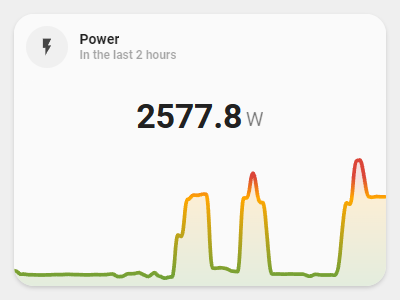

# Custom-card "Power details"

The `custom_card_damix48_power_details` is an extension of the standard graph card and can show a detailed graphs of power consumption. If hover (or tap in mobile) the points of the line show the average power in that time interval.



## Credits
Author: Damix48
Version: 0.1.0

## Changelog
<details>
<summary>0.1.0</summary>
Initial release.
</details>

## Usage

```yaml
- type: "custom:button-card"
  template: custom_card_damix48_power_details
  variables:
    ulm_card_power_details_name: Power
    ulm_card_power_details_entity: sensor.shellyem_id_channel_1_power
    ulm_card_power_details_hours: 2
    ulm_card_power_details_24hour: true
    ulm_card_power_details_thresholds:
      - value: 0
        color: "#43A047"
      - value: 2500
        color: "#FFA600"
      - value: 3000
        color: "#DB4437"
```

## Requirements
Need [mini-graph-card](https://github.com/kalkih/mini-graph-card)

## Variables
<table>
<tr>
<th>Variable</th>
<th>Example</th>
<th>Required</th>
<th>Explanation</th>
</tr>
<tr>
<td>ulm_card_power_details_entity</td>
<td>sensor.shellyem_id_channel_1_power</td>
<td>yes</td>
<td>Power sensor entity</td>
</tr>
<tr>
<td>ulm_card_power_details_name</td>
<td>"Power"</td>
<td>no</td>
<td>Name to show on card.</td>
</tr>
<tr>
<td>ulm_card_power_details_hours</td>
<td>2</td>
<td>no</td>
<td>Number of hour to show in the graph (2 is the default value)</td>
</tr>
<tr>
<td>ulm_card_power_details_24hour</td>
<td>true</td>
<td>no</td>
<td>Switch from AM/PM (default) to 24h format</td>
</tr>
<tr>
<td>ulm_card_power_details_thresholds</td>
<td>
<pre>
- value: 0
  color: "#43A047"
- value: 2500
  color: "#FFA600"
- value: 3000
  color: "#DB4437"
<pre>
</td>
<td>no</td>
<td>Thresholds to change color in the graph according to power value (default is only one color)</td>
</tr>
<tr>
<td>ulm_card_power_details_height</td>
<td>180</td>
<td>no</td>
<td>Height of the graph (180 is the default value)</td>
</tr>
</table>

## Template code

```yaml
---
custom_card_damix48_power_details:
  template:
    - "ulm_custom_card_damix48_power_details_language_variables"
  variables:
    ulm_card_power_details_name: "n/a"
    ulm_card_power_details_hours: 2
    ulm_card_power_details_24hour: false
    ulm_card_power_details_height: 180
  triggers_update: "all"
  styles:
    grid:
      - grid-template-areas: "'item1' 'item2'"
      - grid-template-columns: "1fr"
      - grid-template-rows: "min-content  min-content"
    card:
      - border-radius: "var(--border-radius)"
      - box-shadow: "var(--box-shadow)"
      - padding: "0px"
  custom_fields:
    item1:
      card:
        type: "custom:button-card"
        template:
          - "icon_info"
          - "card_generic"
        styles:
          card:
            - box-shadow: "none"
            - border-radius: "var(--border-radius) var(--border-radius) 0px 0px"
            - padding: "12px"
        entity: "[[[ return variables.ulm_card_power_details_entity ]]]"
        name: |
          [[[
            if (variables.ulm_card_power_details_hours == 1) {
              return variables.ulm_custom_card_damix48_power_details_in_the_last + " " + variables.ulm_custom_card_damix48_power_details_hour;
            } else {
              return variables.ulm_custom_card_damix48_power_details_in_the_lasts + " " + variables.ulm_card_power_details_hours + " " + variables.ulm_custom_card_damix48_power_details_hours;
            }
          ]]]
        label: "[[[ return variables.ulm_card_power_details_name ]]]"
    item2:
      card:
        type: "custom:mini-graph-card"
        template:
          - "icon_info"
          - "card_generic"
        entities:
          - entity: "[[[ return variables.ulm_card_power_details_entity ]]]"
        color_thresholds: |
          [[[
            if (variables.ulm_card_power_details_thresholds) {
              return variables.ulm_card_power_details_thresholds;
            } else {
              return [{
                value: 0,
                color: "var(--info-color)"
              }];
            }
          ]]]
        hours_to_show: "[[[ return variables.ulm_card_power_details_hours ]]]"
        points_per_hour: "[[[ return Math.floor(120 / variables.ulm_card_power_details_hours) ]]]"
        name: "[[[ return variables.ulm_card_power_details_name ]]]"
        hour24: "[[[ return variables.ulm_card_power_details_24hour ]]]"
        decimals: 1
        show:
          name: false
          icon: false
          legend: false
          state: true
        align_state: center
        height: "[[[ return variables.ulm_card_power_details_height ]]]"
        style: |
          ha-card {
            box-shadow: none;
            border-radius: var(--border-radius);
          }
          ha-card .state {
            font-weight: bold;
            font-size: 14px;
          }
          ha-card .graph__labels > span {
            background: var(--card-background-color);
            color: var(--secondary-text-color)
          }
```
