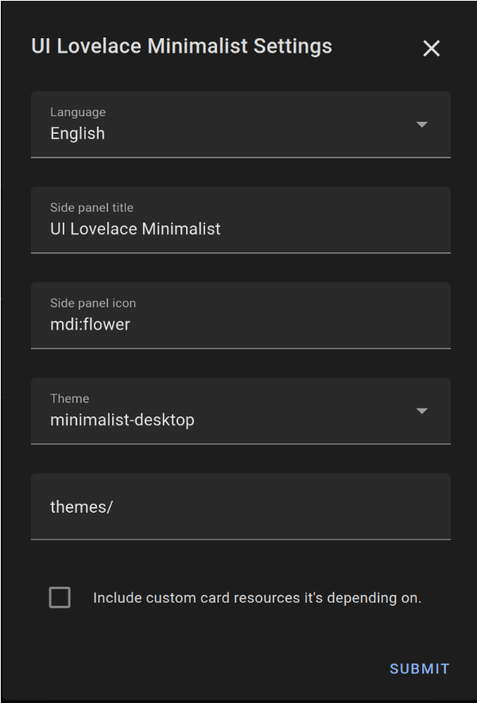

Before get started on anything, make sure you have created a backup of your home assistant configuration.

> In case you experience problems during installation please reach join the [Discord Server](https://discord.gg/TPXg9b7GfR).

You can install this UI Lovelace Minimalist Theme manual or throuhg HACS.

!!! danger "Breaking Changes"
    This integration is still under heavy development and might cause breaking changes

## HACS

### Prerequisites

For the pop-up cards to work it's required to install the Custom Integration called `browser-mod`. This can be done in HACS and search under Integration on `browser-mod`. Optionally you can install Frontend modules, but the integration also has a checkmark to include and configure them for you.

### Install Repository

To find this Integration on HACS we first need to add the UI Lovelace Minimalist (ULM) repository to Custom Reposistories.

1. Go to HACS
2. Click on Integrations
3. Click on 3-dots in the Right-Top corner and select "Custom Repositories"
    1. Repository: https://github.com/UI-Lovelace-Minimalist/UI
    2. Category: Integration
    3. Add
4. New Repository Should pop-up, if this is not the case hit "Explore & Download Repositories"
5. Search for "UI Lovelace Minimalist" and click "Download this Repository with HACS"
6. Select the version (will auto select latest)
7. Now we need to restart home-assistant under 
8. Wait until Home assistant is restarted and Continue to [Install Integration](#install-integration)

### Install Integrations

Open your Home Assistant instance and start setting up "UI Lovelace Minimalist". Or you can use the My Home Assistant Button bellow.

Now you can configure the Integration, you can do this also after it's installed!

- Language: Will set the language for the Integration.
- Side panel title: Will set the title for the Lovelace Dashboard in the Sidebar.
- Side panel icon: Which icon to put in front of the Title.
- Theme: Select the desktop or mobile theme.
- Theme path: Make sure this is set to the same path as is configured in your `configuration.yaml` (default: `/themes`)
- Include Custom Cards: This will make sure almost all dependency cards are included and configured for you.
    - button-card
    - card-mod
    - mini-graph-card
    - mini-media-player
    - my-cards-slider-card
    - light-entity-card

Hit submit and in the Sidebar a new entry should appear.

In case you want to use this Theme in your own ui-lovelace files go to [Configuration](../configuration).

## Manual

Todo: <Might want to create release package to make this easier as docs is also in here>

- `/config/ui_lovelace_minimalist` directory
